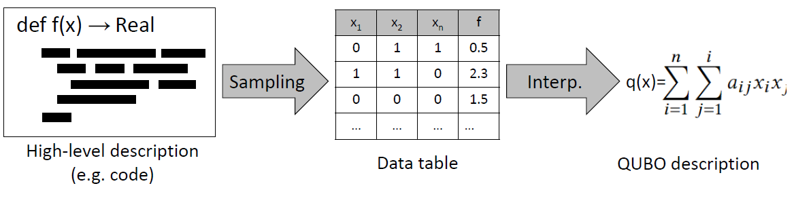

 #  AUTOmated QUBO Generator

 AUTOmated QUBO Generator is an automatic tool for converting a high-level description
of an optimization problem, written in Python, into an equivalent QUBO representation.
It is doing this by using a novel **data driven** translation method that
can completely decouple the input and output representation.

<p align="center">

</p>


This repository acts as a companion to our publications:

1. Alberto Moraglio, Serban Georgescu, and Przemysław Sadowski. 2022. AutoQubo: Data-driven automatic QUBO generation. In Genetic and Evolutionary Computation Conference Companion (GECCO ’22 Companion), July 9–13, 2022, Boston, MA, USA. ACM, New York, NY, USA, 8 pages. https://doi.org/10.1145/3520304.3533965

2. Justin Pauckert, Mayowa Ayodele, Marcos Diez García, Serban Georgescu, and Matthieu Parizy. 2023. AutoQUBO v2: Towards Efficient and Effective QUBO Formulations for Ising Machines. In Genetic and Evolutionary Computation Conference Companion (GECCO ’23 Companion), July 15–19, 2023, Lisbon, Portugal. ACM, New York, NY, USA, 4 pages. https://doi.org/10.1145/3583133.3590662

Installation
------------

create conda environment with all dependencies
```
conda env create -f environment.yml
```
activate it
```
conda activate autoqubo
```
install autoqubo as package
```
pip install -e .
```

How to cite
-----------
If you find our work useful, please cite the paper below:

```
@inproceedings{10.1145/3520304.3533965,
    author = {Moraglio, Alberto and Georgescu, Serban and Sadowski, Przemys{\l}aw},
    title = {AutoQubo: Data-driven Automatic QUBO Generation},
    year = {2022},
    isbn = {978-1-4503-9268-6/22/07},
    publisher = {Association for Computing Machinery},
    doi = {10.1145/3520304.3533965},
    booktitle = {Proceedings of the Genetic and Evolutionary Computation Conference Companion},
    series = {GECCO '22} 
}
```


